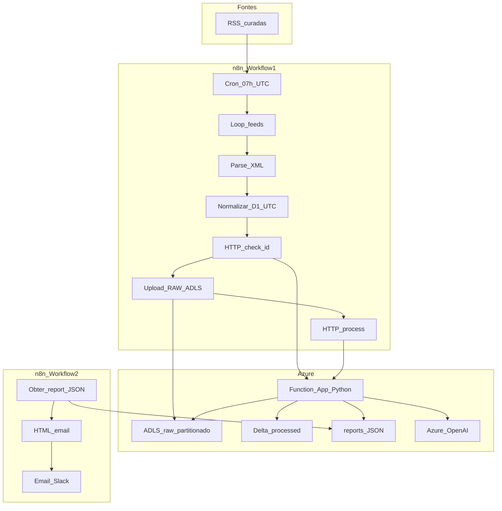

> **Histórico Cursor:** várias secções abaixo descrevem o desenho **inicial** (ex.: janela 30d, top 3 LinkedIn). O estado **canónico** em produção está em [`docs/estado-atual-pipeline.md`](../../docs/estado-atual-pipeline.md).

# Plano: Daily Tech Intelligence Pipeline (Azure + n8n + Python)

## Contexto do repositório

- O workspace [C:\Projetos\briefing-AIOps](C:\Projetos\briefing-AIOps) está sem código IaC/Functions ainda; este plano define a árvore de ficheiros e a implementação a gerar **após** aprovação.
- Seguir [`.cursor/rules/agent-azure-platform.mdc`](C:\Projetos\briefing-AIOps\.cursor\rules\agent-azure-platform.mdc): **Bicep modular**, **sem** recursos `Microsoft.Authorization/roleAssignments` no IaC; documentar em `docs/rbac-manual.md` as atribuições necessárias para um administrador (MI da Function: *Storage Blob Data Contributor* no storage, *Key Vault Secrets User* no KV, *Cognitive Services OpenAI User* no Azure OpenAI, se usar RBAC no recurso). Até lá, modo operacional com **connection string / keys** em App Settings (Contributor-friendly), sem commit de segredos no Git.

## Arquitetura lógica

**Decisão de desenho (robustez):** a janela de **30 dias** aplica-se ao **`published_at` em UTC** (fechada em «ontem»); o `/process` agrega várias partições diárias. Particionamento RAW continua por **data de publicação (UTC)** do item.

**Idempotência:** `id = sha256(url)` (hex minúsculo, canónico). Antes de gravar RAW, `/check-id` verifica se já existe blob em `raw/.../source=SOURCE/{id}.json` (HEAD/list) **ou** entrada numa tabela Delta auxiliar `idempotency/ids` (opcional; o plano base usa **existência de blob** como fonte de verdade para ingestão, e **MERGE** no Delta `processed` para escrita idempotente no processamento). Isto cumpre “skip se existe” sem depender de scraping.

**RSS frágil:** parser tolerante, timeouts, retry com backoff no n8n e na Function (`tenacity` para OpenAI). Itens sem `published` parseável: **descartar** por defeito (não entram na janela).

---

## 1. Infraestrutura (Bicep)

**Local sugerido:** [`infra/bicep/`](C:\Projetos\briefing-AIOps\infra\bicep)

| Módulo | Conteúdo |
|--------|----------|
| `rg.bicep` | Resource group (opcional se RG já existir — parâmetro `useExistingRg`) |
| `storage.bicep` | Storage account **com hierarchical namespace** (ADLS Gen2), containers `raw`, `processed`, `reports`, `idempotency` (opcional), lifecycle opcional para raw antigo |
| `keyvault.bicep` | Key Vault (SKU), **sem** RBAC assignments no template; outputs: nome, URI |
| `openai.bicep` | `Microsoft.CognitiveServices/accounts` kind OpenAI, deployment de modelo (parâmetro: nome deployment, modelo, SKU capacity) — sujeito a quota |
| `functionapp.bicep` | Linux Function App **Python 3.11**, **System-assigned MI** (criação do identity é OK; **não** atribuir roles no Bicep), Application Insights, app settings com **referências** `@Microsoft.KeyVault(SecretUri=...)` *após* secrets existirem, ou placeholders + doc para preenchimento pós-deploy |
| `main.bicep` | Orquestração, parâmetros (`environment`, `location`, nomes), outputs (URLs, storage name, function name, OpenAI endpoint) |

**Segredos (Key Vault):** `AzureWebJobsStorage` / `STORAGE_CONNECTION_STRING`, `OPENAI_API_KEY` ou uso de key via settings, `OPENAI_ENDPOINT`, `OPENAI_DEPLOYMENT_NAME`, opcional `FUNCTION_KEY` apenas se documentado como rotação externa. **Nunca** valores reais no Git.

**Ficheiros extra:** [`docs/rbac-manual.md`](C:\Projetos\briefing-AIOps\docs\rbac-manual.md) com comandos `az role assignment create` para admin; [`docs/deployment.md`](C:\Projetos\briefing-AIOps\docs\deployment.md) com ordem: deploy Bicep → criar secrets → deploy Function → configurar n8n.

---

## 2. Azure Functions (Python)

**Local sugerido:** [`function-app/`](C:\Projetos\briefing-AIOps\function-app) (v2 programming model, `function_app.py` + `requirements.txt` + `host.json`).

### Endpoints HTTP (Function-level auth: function key ou EasyAuth futuro)

| Rota | Método | Comportamento |
|------|--------|---------------|
| `/api/check-id` | GET ou POST | Input: `id`, opcional `source`, `published_date` (para construir prefixo). Usa `DataLakeServiceClient` + `get_file_client` ou listagem por padrão; resposta JSON `{ "exists": bool }`. |
| `/api/process` | POST | Body: `{ "date": "YYYY-MM-DD", "lookback_days": 30 }` (`date` = fim da janela, tipicamente ontem UTC). Passos: para cada dia entre `date − (lookback_days−1)` e `date`, listar RAW; dedupe por `id`; classificação + score + resumo LLM; **MERGE** Delta; **LinkedIn top-3** (excl. ids em `linkedin-featured-article-ids.json`); insights executivos; `reports/daily-report-{date}.json`. |
| Opcional `/api/report` | GET | `?date=YYYY-MM-DD` — devolve JSON do relatório de `reports/` (para Workflow 2 n8n sem credenciais de storage, usando function key). |

**Dependências Python principais:** `azure-storage-file-datalake`, `azure-identity`, `openai` (Azure), `deltalake`, `pyarrow`, `feedparser` *não* necessário na Function se o parse for só no n8n; `pydantic` para validação de payloads; `tenacity` para retries OpenAI.

**Classificação e score (modular):** módulo `classification.py`: heurísticas por palavras-chave + domínio da fonte → `AI` \| `Architecture` \| `Data` (mapear “Data Platform” para **`Data`** no Delta para bater com o relatório `Data`). Score 0–100 (regras + opcional segundo passo LLM só se necessário para manter custo previsível).

**LLM:** uma chamada **por artigo** (ou batch com limite de tokens) com modelo deployado; prompt curto para `summary` técnico. Relatório agregado: segunda chamada com o prompt “senior AI/Data Architect” sobre **lista consolidada do dia**, saída estruturada JSON para `sections` e `sources`.

**Delta:** caminho `processed/` como tabela Delta única `articles` com schema: `id`, `source`, `title`, `url`, `published_at`, `category`, `score`, `summary`, `ingested_at`, `processing_run_id` (UUID por execução para auditoria e reprocessamento seguro).

**Reprocessamento seguro:** `POST /process` com mesmo `date` refaz MERGE (mesmo `id` atualiza colunas); relatório sobrescrito com versão nova. Opcional: gravar `reports/archive/run_id=...` (parâmetro `archive=true`).

**Logging / erros:** `logging` + correlation id por request; HTTP 4xx para validação; 5xx só após esgotar retries OpenAI; timeouts configurados.

---

## 3. n8n — dois workflows (JSON importável)

**Local sugerido:** [`n8n/workflow-ingestion.json`](C:\Projetos\briefing-AIOps\n8n\workflow-ingestion.json), [`n8n/workflow-delivery.json`](C:\Projetos\briefing-AIOps\n8n\workflow-delivery.json).

### Workflow 1 — Ingestão

- **Schedule:** cron `0 7 * * *` timezone **UTC** (07:00 UTC).
- **Constante:** array das 8 URLs RSS fornecidas + mapeamento `source` curto (`netflix`, `uber`, `airbnb`, `databricks`, `openai`, `huggingface`, `deeplearning-ai`, `azure-updates`).
- **SplitInBatches** ou loop: fetch XML (HTTP Request), XML parse (n8n XML node).
- **Code node:** normalizar itens → `{ id, source, title, url, published_at, summary: description|content, ingested_at }` com `published_at` em ISO8601 UTC; **filtrar** itens onde `published_at` ∈ `[yesterday 00:00:00 UTC, yesterday 23:59:59.999 UTC]` (usar `DateTime` explícito; **não** janela móvel de 24h).
- Para cada item: **HTTP** `GET/POST` Function `/api/check-id` — se `exists`, skip.
- **Upload RAW:** nó **Azure Storage** (ou HTTP PUT com SAS) para `raw/year=.../month=.../day=.../source=SOURCE/{id}.json` com corpo JSON exatamente no formato pedido.
- Após lote: **HTTP POST** `/api/process` com `{ "date": "<yesterday-UTC-date>", "lookback_days": 30 }`.

**Credenciais n8n:** variáveis de ambiente (Function base URL + function key, storage SAS ou connection string fragment) — documentado em `docs/deployment.md`, sem valores no repo.

### Workflow 2 — Entrega

- Schedule opcional (ex.: 07:30 UTC) ou webhook pós-processo.
- HTTP GET `/api/report?date=...` **ou** leitura direta do blob `reports/daily-report-{date}.json`.
- **HTML template** em Code node ou HTML node: secções por categoria, bullets, links `href` nos títulos.
- **Email** (SMTP ou serviço) + opcional **Slack** webhook.

---

## 4. Esquemas e exemplos

**Ficheiro:** [`docs/schemas.md`](C:\Projetos\briefing-AIOps\docs\schemas.md) — RAW JSON, schema Delta (tabela + tipos), schema do report final.

**Ficheiro:** [`docs/api-examples.http`](C:\Projetos\briefing-AIOps\docs\api-examples.http) ou `.md` — exemplos `check-id`, `process`, `report` com respostas esperadas.

---

## 5. Riscos e mitigações

| Risco | Mitigação |
|-------|-----------|
| Feeds sem datas fiáveis | Filtro de janela estrito + skip + métrica/log de itens descartados |
| Custos OpenAI | Summaries por artigo concisos; um único relatório agregado; limitar `max_tokens` |
| Contributor sem RBAC MI | Documentação manual + uso de connection string nas Functions até RBAC |
| Delta + Python em Consumption | Cold start: considerar Premium ou mínimo de memória; `requirements.txt` pinado |

---

## 6. Ordem de implementação (após aprovação)

1. Estrutura de pastas + Bicep (storage, KV, OpenAI, Function, main) + `docs/rbac-manual.md` + `docs/deployment.md`.
2. Function App: client ADLS, `check-id`, `process` (sem LLM primeiro), Delta write; depois integrar Azure OpenAI e relatório.
3. Export n8n (ingestion + delivery) + validação manual de import.
4. Schemas + exemplos HTTP.
5. (Opcional) script `az` ou `Makefile` para deploy local.

Nenhum scraping HTTP além de **GET dos feeds RSS** (conteúdo permitido pelo utilizador).
