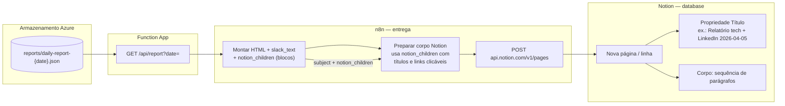
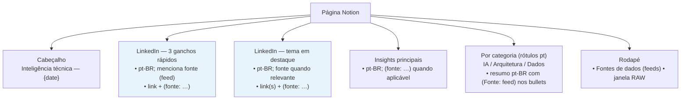

# Estrutura do relatório → Notion

O workflow de entrega transforma o JSON do relatório (`daily-report-YYYY-MM-DD.json`) em **e-mail HTML** e, em paralelo, numa **nova linha na base Notion**: a propriedade **Título** vem do assunto do e-mail; o **corpo da página** são blocos `paragraph` com o texto plano equivalente (mesma ordem que o e-mail).

## 1. Do blob JSON à página Notion



## 2. Conteúdo lógico (ordem no corpo Notion ≈ ordem do e-mail)

Cada secção abaixo origina **texto contínuo** nos parágrafos; não há colunas Notion por campo JSON — tudo flui como narrativa.



## 3. Modelo de dados do relatório (referência)

O Notion **não** guarda este JSON; serve de referência do que alimenta o HTML/texto que vês na página.

```mermaid
flowchart TB
  REP[daily-report JSON]

  REP --> M[Metadados\ndate, lookback_days, window_*, sources, processing_run_id]
  REP --> LI[linkedin_short_topics\naté 3 × hook_line, scores, artigos]
  REP --> LD[linkedin_deep_topic\nangle_for_post longo, artigos]
  REP --> LT[linkedin_topics\nespelho dos 3 curtos]
  REP --> LLM[llm_insights\nkey_insights, trends, …]
  REP --> SEC[sections\nAI | Architecture | Data]

  LI -.->|gera secções LinkedIn no HTML| LD
```

Para o contrato completo dos campos, ver [schemas.md](schemas.md).
